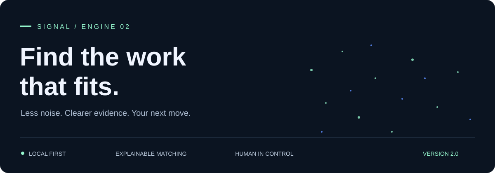
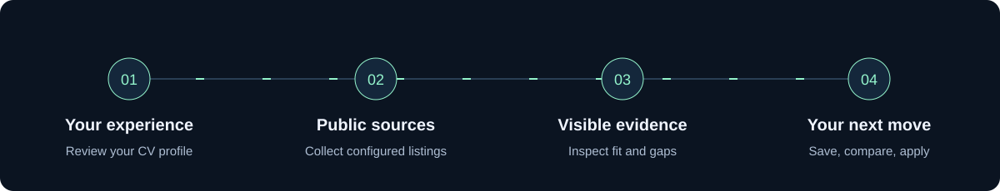
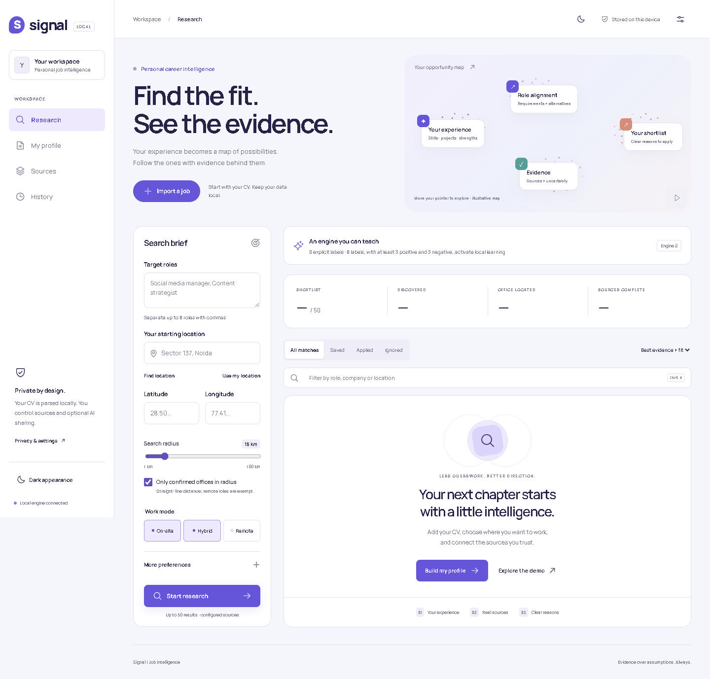

# Signal — local job intelligence

**Latest edition by [ansh2807](https://github.com/ansh2807)** · Forked from the [original public v1 by AnushkaMarketing](https://github.com/AnushkaMarketing/signal-job-intelligence/releases/tag/v1.0.0). See [release lineage](RELEASE-HISTORY.md).

<p align="center"></p>

<p align="center"><a href="https://github.com/AnushkaMarketing/signal-job-intelligence/actions/workflows/validate.yml"></a> · <a href="https://github.com/AnushkaMarketing/signal-job-intelligence/releases">Releases</a> · <a href="ENGINE-V2.md">Inside the engine</a></p>

A private research workbench built with React, TypeScript, FastAPI and encrypted SQLite. Upload a CV, review its extracted profile, configure permitted sources and inspect an explainable shortlist of up to 50 jobs.

**Repository update:** v2 is now included in AnushkaMarketing’s original public repository. Ansh’s Engine 2 and motion commits remain in the shared history, so both contributors are visible through GitHub’s commit and contributor views.

**Engine 2 upgrade:** responsive particle motion, required/optional/alternative reasoning, broader skill relationships, shortlist gap analysis and a trainable local preference model. See [ENGINE-V2.md](ENGINE-V2.md) for methods, data requirements and evaluation limits. The model starts untrained and activates only after sufficient explicit relevance labels. Priority now includes a bounded feedback adjustment and an explicit must-have evidence cap.

<p align="center"></p>

The SVG artwork is self-contained and includes lightweight animation plus reduced-motion support. Pointer-reactive particles run in the app itself; GitHub README images cannot execute JavaScript.



## Start on Windows

Requires Python 3.11+ and Node 22+. From this directory:

```powershell
.\START.ps1
```

Open **http://127.0.0.1:8765**. Keep the terminal running. Use `START.ps1 -Rebuild` after frontend changes. First launch installs dependencies if absent. The backend uses the included exact `requirements.lock`; JavaScript uses `package-lock.json`.

If PowerShell blocks a downloaded script, inspect its contents and run the equivalent commands manually:

```powershell
python -m venv .venv
.venv\Scripts\python -m pip install -r requirements.lock
npm ci
npm run build
.venv\Scripts\python -m uvicorn backend.main:create_app --factory --host 127.0.0.1 --port 8765
```

## Use it

1. **My profile:** upload PDF/DOCX/TXT or paste CV text. Review extracted information and save. Local extraction is heuristic; unknown fields remain blank. Scanned PDFs need OCR first.
2. **Sources:** enter employer Greenhouse/Lever IDs, individual company job-page URLs, enable Remotive for remote work, or import a listing manually. Save sources.
3. **Research:** choose roles, starting address/PIN or coordinates, radius, work modes and optional salary/experience preferences. Address lookup uses OpenStreetMap Nominatim only when requested; browser location requires its normal permission.
4. Start research. Source failures remain visible while other sources continue. Open **Research notes & diagnostics** to see the plan, exclusions, request/cache counts and source limitations.
5. Open **View evidence** for factors, gaps, related skills, company checks, location certainty, original description and provenance. Save, ignore, mark applied or open the original application. No application is submitted by this app.

**Explore the demo** uses a fictional marketing profile, employers and coordinates. It performs no public requests or verification and never replaces your real profile/preferences. Demo histories are explicitly labelled.

## What the engine does

- Local CV text extraction with a 5 MB input limit, 40-page PDF limit, DOCX decompression checks, 15-second worker timeout, 512 MB memory and 12-second CPU limits.
- Skill aliases and related-skill graph, title families, required/preferred requirement classification, inferred work signals and editable profile provenance.
- Weighted skill, experience, role, seniority, industry, education, certification, project and career-continuity factors. Related skills get partial credit; missing information is unscored.
- Haversine distance with office/city/neighborhood precision. Strict radius excludes unknown and approximate offices. Remote roles are exempt from the distance filter, but geographic/work-authorization restrictions remain visible.
- Independent public-source collection, canonical normalization, conservative deduplication, bounded candidate analysis and progressive results. Returns at most 50 results.
- Listing reachability, expiry/conflict checks, cross-domain JobPosting corroboration and attributed company structured-data claims. Business identity and reputation stay unconfirmed unless evidence exists; an HTTP 200 is never proof of legitimacy.
- Optional OpenAI-compatible/local LLM advice for the top three jobs. Disabled by default; explicit consent required. Only skills, experience years, current role and job text are sent. Evidence quotes and referenced profile skills are validated. AI cannot change scores or verification.
- Encrypted local preferences, saved/ignored/viewed/applied states, last 20 searches and TTL caches. Delete the workspace in settings. Export individual job evidence as JSON.

## Scores and evidence

CV fit is a weighted mean over known CV factors. **Coverage** is the proportion of factor weight with usable evidence. Priority is:

`0.65 × CV fit × (0.5 + coverage / 200) + 0.20 × preference fit + 0.15 × verification confidence × 100`

These are transparent heuristics, not calibrated hiring probabilities. Required and preferred requirements come from explicit section wording; inferred requirements/signals are labelled. Projects support relevance, not claimed years of professional experience. All weights live in `backend/matching.py`.

## Source coverage and limits

| Source | Collection | Limits |
|---|---|---|
| Greenhouse | Public employer board API | Configure board IDs; no global job search |
| Lever | Public employer postings API | Configure site IDs; up to 500 jobs per board |
| Company pages | Public JobPosting JSON-LD | Robots rules respected; JavaScript-only pages may need manual import |
| Remotive | Public remote-job API | Feed delayed 24h; cached 6h; attribution/original links retained |
| LinkedIn | Search links + manual import | No authorized browser bridge; no scraping, cookies or authentication claims |

Official references: [Greenhouse](https://docs.greenhouse.io/job-board.html), [Lever](https://github.com/lever/postings-api), [Remotive](https://remotive.com/remote-jobs/api).

The engine searches configured sources, not all employers on the internet. It has no corporate-registry or search-engine API provider configured. Employer pages often omit exact office coordinates; strict radius can correctly return zero jobs. Office coordinates from a listing or user are attributed claims, not a site visit. Distances are straight-line, not driving distance. Unknown salaries are never estimated or converted.

## Privacy and security

- Localhost binding, trusted-host/origin checks, per-process API token, CSRF protections, request-size limits and safe text rendering.
- Public source URLs are DNS-validated and pinned for each connection. All resolved IPs must be public; private/loopback/link-local addresses, embedded credentials, non-web ports and unsafe redirects are blocked.
- External calls are throttled by host, bounded, cached, retried once on server errors and subject to cooldown/circuit protection. No proxy rotation or authentication bypass.
- Records are Fernet-encrypted. Windows DPAPI protects the local key; POSIX uses a mode-0600 key. This does not protect against a compromised active user account. `.local`, `.venv`, credentials and test artifacts are excluded from source control.
- Uploaded document bytes and raw pasted CV text are not persisted. Original descriptions and structured profiles are stored encrypted. A parser subprocess has resource limits, denied Python network/process calls and no macro execution. **This is containment, not a full OS security sandbox**; use trusted documents. An OS-isolated parsing service is an extension point before exposing uploads to untrusted users.
- Reset cancels active tasks, deletes encrypted records and compacts SQLite. It cannot delete previously exported files, OS backups or data already sent to an explicitly enabled model provider.
- This build is intended for local single-user operation. It is not a reviewed public multi-user deployment.

## Development and verification

```powershell
# Backend
.venv\Scripts\python -m uvicorn backend.main:create_app --factory --host 127.0.0.1 --port 8765
# Separate terminal: Vite proxies /api to the local backend
npm run dev

# Unit / integration tests
.venv\Scripts\python -m pytest -q
# Type checks and production bundle
npm run build
# Browser smoke test: Chrome installed, backend uses isolated test data on 8766
node scripts/ui-smoke.mjs
```

Browser smoke coverage: initial dashboard, multi-role typing, demo pipeline, evidence dialog, saving, CV extraction/editing, manual job import, real local pipeline, theme switching, 375px layout and complete reset. Screenshots are in ignored `test-results/`. Use `CHROME_CHANNEL` to change the installed Chromium channel.

See [ARCHITECTURE.md](ARCHITECTURE.md) for extension boundaries. `JobSource` and `LLMProvider` are provider interfaces. Ranking, geography, verification and storage are independent services. Private historical shortlist data are excluded from this distribution.

